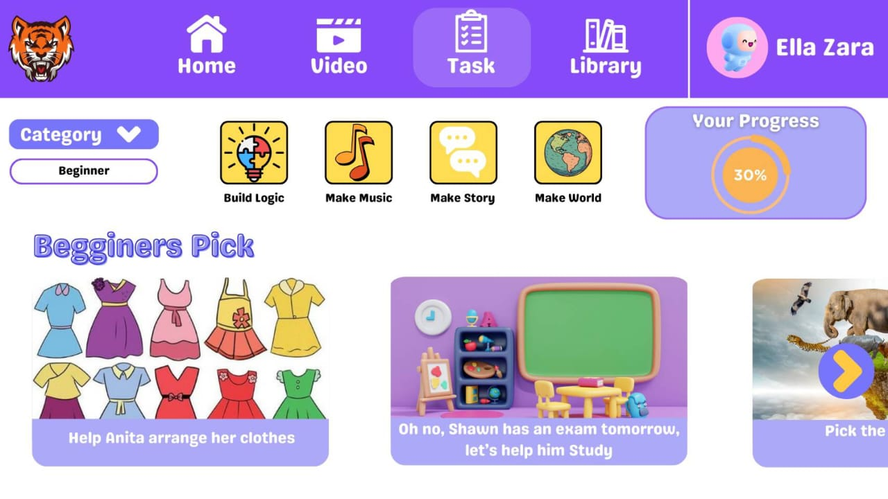
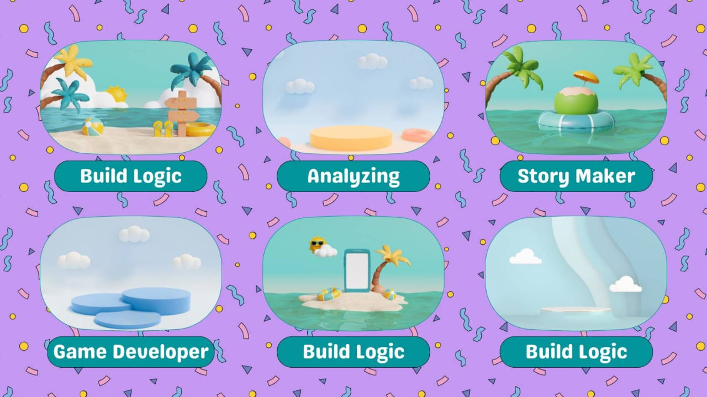
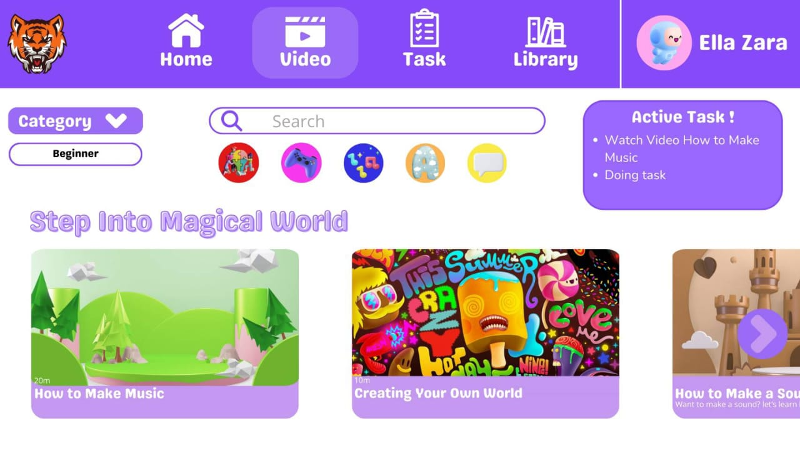
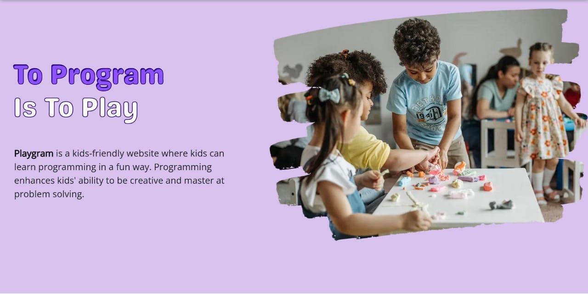
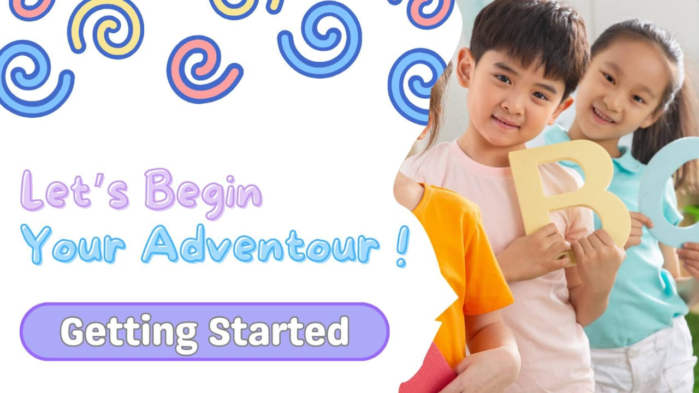
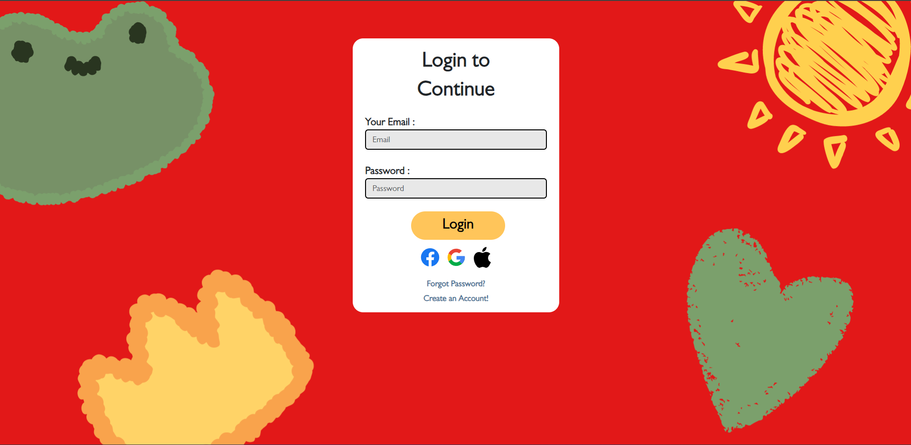
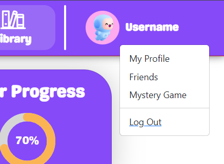

# PlayGram

## Welcome to PlayGram!

Halo semuanya! Perkenalkan kami dari Tim Tahu Bulat mempersembahkan software belajar programming pemula, PlayGram!

Software kami ini berupa website yang menyediakan berbagai fitur unik untuk belajar programming dari 0. 

## Untuk apa website ini kami buat?

Latar belakangnya website PlayGram ini dibuat adalah banyaknya orang yang tertarik akan mempelajari programming terkadang masih sulit memahaminya karena kesulitan dari programming yang terkadang memerlukan kecepatan berpikir yang tinggi

## Apa saja sih fitur yang ada di PlayGram?

Fitur-fitur yang membuat kami yakin akan keberhasilannya untuk membantu kalian memahami programming, mulai dari video tentang apa itu programming, beberapa kegiatan asik yang mudah untuk diikuti, hingga artikel singkat jika kalian lebih gemar membaca.

## Solusi dari latar belakang, apakah terjamin di website ini?

Ya, kami yakin akan solusi yang kami sediakan dapat menyelesaikan masalah tersebut, solusinya yaitu mempermudah cara pembelajaran menjadi lebih visual dibandingkan teks berlogika.

## Kalau gitu tunggu apalagi?

Yuk teman-teman, kita mulai perjalanan memahami programming kita mulai dari PlayGram!

---

# Mulai PlayGram!

## Sign Up dan Login

Kita mulai perjalanan kita dengan membuat akun atau sign up terlebih dahulu, agar proses belajar kita dapat disimpan di akun kita.

Jika sudah membuat akun, langsung dapat ke laman login dan masukan email beserta password yang sudah kita taruh pada saat membuat akun

## Belajar dengan Berbagai Cara!

Setelah memasukan akun kita, kita bisa langsung memulai pembelajaran dengan berbagai fitur yang ada, mulai dari video, lalu ada kegiatan yang seru dan interaktif, dan juga artikel singkat setelah kita memahami secara singkat programming melalui fitur belajar sebelumnya

## Logout, Perpisahan Bukanlah Akhir Segalanya

Mungkin terkesan sedih bila kita berpisah dengan suatu hal yang membekas di hati, tapi itu bukan akhir dari perjalananmu untuk menjadi programmer yang handal!

Kamu bisa melanjutkan perjalananmu dengan cara login seperti yang kita lakukan di awal.

Jangan sedih patriot, perjalananmu belum berakhir!

---

# Terima Kasih!

Seperti yang kami bilang sebelumnya, ini bukan akhir pertemuan kita. Akan kami tunggu kamu sekalian di puncak kesuksesan programming.

Sekian dari kami, Terima Kasih Banyak!

